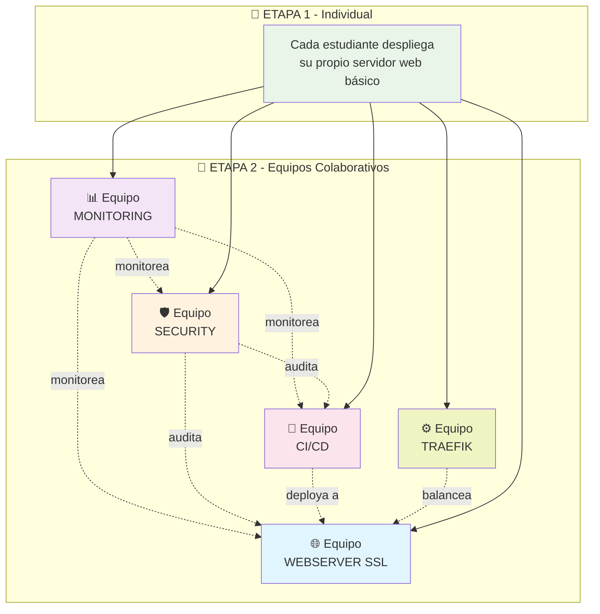

# 🚀 Infra Made Easy - Curso Colaborativo de DevOps

**Aprende infraestructura moderna** con Ansible, AWS y herramientas profesionales a través de **ejercicios colaborativos en equipos especializados**.

[](https://ansible.com)
[](https://aws.amazon.com)
[](https://prometheus.io)
[](https://grafana.com)

---

## 🎯 Metodología del Curso

### **Enfoque Colaborativo Único**
Este curso simula un **entorno DevOps real** donde diferentes equipos especializados trabajan juntos en una infraestructura compartida, **tal como ocurre en empresas tech**.



---

## 🔥 Inicio Súper Rápido

### **¡Solo 4 comandos para empezar!**

```bash
# 1️⃣ Configurar entorno
git clone https://github.com/SOLx-AR/infra-made-easy.git
cd infra-made-easy && ./activate-env.sh

# 2️⃣ Verificar que todo funciona
./verify-setup.sh

# 3️⃣ ETAPA 1: Tu primer servidor (individual)
ansible-playbook etapa1-webserver-basico.yml

# 4️⃣ ETAPA 2: Únete a un equipo (ej: monitoring)
ansible-playbook setup-monitoring.yml
./verify-monitoring.sh  # ¡Verificar que funciona!
```

---

## 🎯 ETAPA 1 - Fundamentos Individuales

### **🎆 Lo que lograrás:**
- ✅ Instancia EC2 en AWS funcionando
- ✅ Servidor web Nginx configurado
- ✅ Página personalizada con tu nombre  
- ✅ SSH y usuarios configurados
- ✅ Base sólida para la Etapa 2

### **📝 Despliegue:**
```bash
# Configurar tu servidor en inventory/hosts
echo "mi-servidor ansible_host=TU_IP_EC2 student_name=tu-nombre" >> inventory/hosts

# Desplegar automáticamente
ansible-playbook etapa1-webserver-basico.yml

# Verificar
curl http://TU_IP_EC2  # ¡Deberías ver tu página!
```

---

## 🤝 ETAPA 2 - Equipos Especializados

**Una vez completada la Etapa 1**, únete a uno de los 5 equipos especializados que **interactúan entre sí** como en una empresa real.

### 📊 **Equipo MONITORING** 
> **🎯 Misión**: Vigilar la salud de TODA la infraestructura del curso

```bash
# Desplegar stack completo Prometheus + Grafana
ansible-playbook setup-monitoring.yml

# Verificar instalación
./verify-monitoring.sh
```

**🚀 Lo que construyes:**
- **Prometheus** recolectando métricas de todos los servidores
- **Grafana** con dashboards automáticos  
- **Node Exporters** en cada servidor
- **Alertas** cuando algo falle
- **Métricas centralizadas** de toda la infraestructura

**📊 Accesos:**
- Grafana: `http://servidor:3000` (admin/admin123)  
- Prometheus: `http://servidor:9090`
- Métricas: `http://servidor:9100/metrics`

---

### 🌐 **Equipo WEBSERVER + SSL**
> **🎯 Misión**: Evolucionar servidores web básicos a **producción con SSL**

```bash
# Configurar SSL automático con Let's Encrypt
ansible-playbook setup-webserver-ssl.yml

# Verificar configuración SSL
./verify-webserver-ssl.sh
```

**🔐 Lo que construyes:**
- **Certificados SSL** automáticos con Let's Encrypt
- **HTTPS** con rating A+ en SSL Labs
- **Headers de seguridad** completos
- **Renovación automática** de certificados
- **Configuración optimizada** de Nginx

**🌍 Accesos:**
- HTTPS: `https://tu-dominio.com`
- HTTP: `http://tu-dominio.com` → redirige a HTTPS
- SSL Status: A+ rating en SSL Labs

---

### 🛡️ **Equipo SECURITY** 
> **🎯 Misión**: Auditar y fortalecer la seguridad de TODA la infraestructura

```bash
# Desplegar auditoría completa con Lynis
ansible-playbook setup-security.yml

# Verificar configuración de seguridad
./verify-security-lynis.sh
```

**🔍 Lo que construyes:**
- **Lynis** ejecutando auditorías automáticas
- **fail2ban** protegiendo contra ataques
- **Dashboard web** con scores de seguridad
- **Métricas** exportadas a Prometheus
- **Reportes** de vulnerabilidades

**🛡️ Accesos:**
- Dashboard: `http://servidor/lynis-dashboard/`
- Métricas: `http://servidor:9114/metrics`  
- Comandos: `lynis audit system`

---

### 🔄 **Equipo CI/CD**
> **🎯 Misión**: Automatizar deployments desde repositorios Git

```bash
# Desplegar pipeline completo
ansible-playbook setup-cicd.yml

# Verificar pipeline
./verify-cicd.sh
```

**🚀 Lo que construyes:**
- **Jenkins** con pipelines automáticos
- **Integración Git** para deploy automático
- **Testing** de aplicaciones
- **Deployment** a servidores web del curso

---

### ⚙️ **Equipo TRAEFIK**
> **🎯 Misión**: Load balancer inteligente para todos los servicios

```bash  
# Desplegar load balancer
ansible-playbook setup-traefik.yml

# Verificar balanceador
./verify-traefik.sh
```

**🔀 Lo que construyes:**
- **Traefik** balanceando tráfico
- **Certificados SSL** automáticos
- **Routing dinámico** entre servicios
- **Dashboard** de monitoreo

---

## 🛠️ Tecnologías y Herramientas

### **Stack Tecnológico Completo**
```
🖥️  INFRAESTRUCTURA          📊  MONITORING              🔒  SECURITY
├── AWS EC2                   ├── Prometheus              ├── Lynis
├── Ubuntu 22.04              ├── Grafana                 ├── fail2ban  
├── Ansible 6+                ├── Node Exporter           ├── UFW
└── SSH Keys                  └── Custom Dashboards       └── SSL/TLS

🌐  WEB STACK                 🔄  CI/CD                    ⚙️  LOAD BALANCER
├── Nginx                     ├── Jenkins                 ├── Traefik
├── Let's Encrypt             ├── Git Integration         ├── ACME
├── SSL A+ Rating             ├── Automated Testing       ├── Dynamic Routing
└── Security Headers          └── Auto Deployment         └── SSL Termination
```

### **🔧 Scripts de Verificación**
Cada equipo tiene scripts dedicados para verificar que todo funcione:

```bash
./verify-all-teams.sh          # 🚀 Verificar TODOS los equipos
./verify-monitoring.sh         # 📊 Stack Prometheus + Grafana
./verify-webserver-ssl.sh      # 🌐 Servidores web con SSL  
./verify-security-lynis.sh     # 🛡️ Auditoría de seguridad
./verify-setup.sh              # ⚙️ Verificación general
```

---

## 📋 Requisitos y Setup

### **💻 Software Necesario**
- **Python** 3.8+ con pip
- **AWS CLI** configurado con credenciales
- **Git** para colaboración
- **SSH** keys para acceso a servidores

### **☁️ AWS**
- Cuenta AWS activa
- Credenciales configuradas: `aws configure`
- Permisos para EC2, Security Groups, etc.

### **🚀 Setup Automático**
```bash
# Todo se configura automáticamente con:
git clone https://github.com/SOLx-AR/infra-made-easy.git
cd infra-made-easy

# Activar entorno y instalar dependencias
./activate-env.sh

# Verificar que todo esté listo
./verify-setup.sh
```

---

## 🏗️ Arquitectura del Sistema

### **🔄 Flujo de Trabajo Colaborativo**
```
┌─────────────────┐    ┌─────────────────┐    ┌─────────────────┐
│   📊 MONITORING  │    │  🌐 WEBSERVER   │    │   🛡️ SECURITY   │
│                 │    │                 │    │                 │
│ Prometheus      │◄───┤ Nginx + SSL     │◄───┤ Lynis Audit     │
│ Grafana         │    │ Let's Encrypt   │    │ fail2ban        │  
│ Dashboards      │    │ Node Exporter   │    │ Security Export │
└─────────────────┘    └─────────────────┘    └─────────────────┘
         ▲                       ▲                       ▲
         │                       │                       │
         └───────────────────────┼───────────────────────┘
                                 │
                    ┌─────────────────┐    ┌─────────────────┐
                    │   🔄 CI/CD      │    │  ⚙️ TRAEFIK     │
                    │                 │    │                 │
                    │ Jenkins         │────┤ Load Balancer   │
                    │ Git Integration │    │ SSL Termination │
                    │ Auto Deploy     │    │ Dynamic Routing │
                    └─────────────────┘    └─────────────────┘
```

### **📊 Métricas Centralizadas**
Todos los equipos exportan métricas que son recolectadas por el equipo de Monitoring:

| Equipo | Puerto | Métricas |
|--------|--------|----------|
| 🖥️ **Sistema** | 9100 | CPU, RAM, Disk, Network |
| 🌐 **Nginx** | 9113 | Requests, Status Codes, Performance |
| 🛡️ **Security** | 9114 | Security Score, Vulnerabilities, Audits |
| 🔄 **Jenkins** | 9115 | Builds, Success Rate, Pipeline Status |
| ⚙️ **Traefik** | 8080 | Load Balancing, SSL, Routing |

---

## 📁 Estructura del Proyecto

```
infra-made-easy/
├── 📋 inventory/hosts                    # 🗺️ Inventario de servidores
├── 🎯 etapa1-webserver-basico.yml        # Playbook individual
├── 🤝 setup-monitoring.yml              # Equipo Monitoring
├── 🤝 setup-webserver-ssl.yml           # Equipo Webserver SSL
├── 🤝 setup-security.yml                # Equipo Security  
├── 🤝 setup-cicd.yml                    # Equipo CI/CD
├── 🤝 setup-traefik.yml                 # Equipo Traefik
├── 🔍 verify-all-teams.sh               # Verificar todos
├── 🔍 verify-monitoring.sh              # Verificar monitoring
├── 🔍 verify-webserver-ssl.sh           # Verificar SSL
├── 🔍 verify-security-lynis.sh          # Verificar security
├── 👥 users/                            # SSH keys estudiantes
│   ├── juan/id_rsa.pub
│   ├── maria/id_rsa.pub  
│   └── nico/id_rsa.pub
├── 🧩 roles/                            # Roles modulares
│   ├── common/              # 🔧 Base + usuarios
│   ├── nginx/               # 🌐 Servidor web  
│   ├── docker/              # 🐳 Contenedores
│   ├── prometheus/          # 📊 Métricas
│   ├── grafana/             # 📈 Dashboards
│   ├── letsencrypt/         # 🔒 SSL automático
│   ├── lynis/               # 🛡️ Auditoría seguridad  
│   ├── fail2ban/            # 🚫 Anti-ataques
│   ├── jenkins/             # 🔄 CI/CD
│   ├── traefik/             # ⚙️ Load balancer
│   └── node-exporter/       # 🖥️ Métricas sistema
├── 📚 docs/                             # Documentación
│   ├── MONITORING-STACK.md
│   ├── ETAPA1.md
│   └── ETAPA2.md  
├── ⚙️ ansible.cfg                       # Config Ansible
├── 📦 requirements.txt                  # Dependencias Python
├── 📦 requirements.yml                  # Collections Ansible
└── 🚀 activate-env.sh                   # Setup automático
```

---

## 🎓 Ejemplos de Uso Por Equipo

### **📊 Equipo MONITORING - Ejemplo completo**
```bash
# 1. Desplegar stack
ansible-playbook setup-monitoring.yml

# 2. Verificar servicios  
./verify-monitoring.sh

# 3. Acceder a dashboards
firefox http://34.122.207.0:3000  # Grafana (admin/admin123)
firefox http://34.122.207.0:9090  # Prometheus

# 4. Comandos útiles
ansible monitoring_servers -a "systemctl status prometheus"
ansible all -a "systemctl status node-exporter" 
curl http://34.122.207.0:9090/api/v1/targets  # Ver targets
```

### **🌐 Equipo WEBSERVER + SSL - Ejemplo completo**
```bash
# 1. Configurar dominio en inventory
echo "web1 ansible_host=1.2.3.4 domain=web1.curso-infra.com" >> inventory/hosts

# 2. Desplegar SSL automático
ansible-playbook setup-webserver-ssl.yml

# 3. Verificar SSL
./verify-webserver-ssl.sh

# 4. Testear SSL
curl -I https://web1.curso-infra.com
openssl s_client -connect web1.curso-infra.com:443 -servername web1.curso-infra.com
```

### **🛡️ Equipo SECURITY - Ejemplo completo**
```bash
# 1. Desplegar auditoría completa
ansible-playbook setup-security.yml

# 2. Verificar seguridad
./verify-security-lynis.sh

# 3. Acceder al dashboard
firefox http://servidor-security/lynis-dashboard/

# 4. Comandos de auditoría
ansible security_servers -a "lynis audit system --quick"
ansible security_servers -a "lynis show report"  
ansible security_servers -a "fail2ban-client status"
```

---

## 🔧 Guía de Resolución de Problemas

### **🚨 Problemas Comunes y Soluciones**

#### **🔴 Error: No se puede conectar al servidor**
```bash
# Verificar SSH
ssh -i ~/.ssh/id_rsa ubuntu@TU_IP

# Verificar inventory
ansible all -m ping

# Verificar security group AWS
aws ec2 describe-security-groups
```

#### **🔴 Error: Servicios no arrancan**
```bash
# Verificar logs
ansible all -a "sudo journalctl -u nginx -n 20"
ansible all -a "sudo journalctl -u prometheus -n 20"

# Verificar configuración  
ansible all -a "sudo nginx -t"
ansible all -a "sudo promtool check config /etc/prometheus/prometheus.yml"
```

#### **🔴 Error: SSL no funciona**
```bash
# Verificar certificados
ansible webserver_ssl_servers -a "sudo certbot certificates"

# Renovar manualmente
ansible webserver_ssl_servers -a "sudo certbot renew --dry-run"

# Verificar DNS
dig TU_DOMINIO.com
```

### **🛠️ Comandos de Debugging**
```bash
# Ver estado de todos los servicios
./verify-all-teams.sh

# Debug específico por equipo
./verify-monitoring.sh      # Prometheus + Grafana
./verify-webserver-ssl.sh   # SSL + Nginx  
./verify-security-lynis.sh  # Security audit

# Logs en tiempo real
ansible all -a "sudo tail -f /var/log/nginx/error.log"
ansible monitoring_servers -a "sudo journalctl -u grafana-server -f"
```

---

## 🎯 Objetivos de Aprendizaje

### **Al completar este curso dominarás:**

#### **🔧 Habilidades Técnicas**
- ✅ **Ansible**: Automatización de infraestructura
- ✅ **AWS**: Gestión de recursos en la nube  
- ✅ **Docker**: Containerización de aplicaciones
- ✅ **Nginx**: Configuración de servidores web
- ✅ **SSL/TLS**: Certificados y seguridad
- ✅ **Prometheus + Grafana**: Monitoring y métricas
- ✅ **Jenkins**: CI/CD y automatización
- ✅ **Lynis**: Auditoría de seguridad
- ✅ **Traefik**: Load balancing inteligente

#### **🤝 Habilidades Colaborativas** 
- ✅ **Trabajo en equipos** especializados
- ✅ **Integración** entre diferentes servicios
- ✅ **Comunicación** técnica efectiva
- ✅ **Resolución de problemas** en grupo
- ✅ **Documentación** de sistemas

#### **💼 Experiencia DevOps Real**
- ✅ **Infraestructura como código** (IaC)
- ✅ **Monitoring** de sistemas en producción
- ✅ **Security hardening** y compliance
- ✅ **CI/CD pipelines** automatizados
- ✅ **Load balancing** y alta disponibilidad

---

## 🚀 ¿Listo para Empezar?

### **🔥 ¡3 pasos y ya estás dentro!**

```bash
# 1️⃣ Clonar y configurar
git clone https://github.com/SOLx-AR/infra-made-easy.git
cd infra-made-easy && ./activate-env.sh

# 2️⃣ Verificar setup
./verify-setup.sh

# 3️⃣ ¡Comenzar!
ansible-playbook etapa1-webserver-basico.yml
```

### **🎉 ¡Únete a la comunidad DevOps más práctica!**

- 📢 **Discord**: Únete a nuestra comunidad
- 🐙 **GitHub**: Contribuye al proyecto  
- 📚 **Docs**: Lee la documentación completa
- 🎥 **YouTube**: Videos tutoriales paso a paso

**¡El futuro de la infraestructura está en tus manos! 🚀**

---

<div align="center">

**Made with ❤️ by the DevOps Community**

[](https://github.com/SOLx-AR/infra-made-easy)
[](https://github.com/SOLx-AR/infra-made-easy/fork)

</div>
