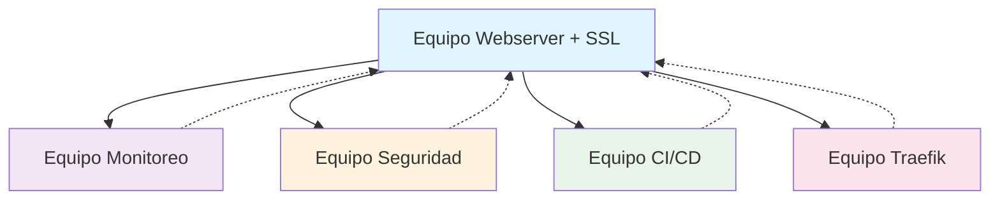

# 🚀 Infra Made Easy - Curso Introductorio

**Curso práctico de infraestructura** para aprender Ansible, AWS y DevOps a través de ejercicios colaborativos.

---

## 🎨 Estructura del Curso

Este curso está dividido en **2 etapas progresivas**:

### 🎯 **ETAPA 1** - Fundamentos (Individual)
**Objetivo**: Que todos los estudiantes desplieguen exitosamente un servidor web básico en AWS

- 💻 Deploy de instancia EC2 en AWS
- 🌐 Instalación de servidor web básico (Nginx)
- 🔑 Configuración de acceso SSH
- ✅ Verificación de funcionamiento

### 🤝 **ETAPA 2** - Equipos Colaborativos (Grupal)
**Objetivo**: Trabajar en equipos especializados que interactúan entre sí

#### 📈 **Equipo 1 - MONITOREO**
- Prometheus + Grafana
- Monitoreo de performance de todos los webservers
- Alertas y dashboards

#### 🌍 **Equipo 2 - WEBSERVER + SSL**  
- Configuración de dominios
- Certificados SSL/TLS
- Optimización de Nginx

#### 🔒 **Equipo 3 - SEGURIDAD (LYNIS)**
- Auditoría de seguridad con Lynis
- Hardening de servidores
- Reportes de seguridad

#### 🔄 **Equipo 4 - CI/CD**
- Deploy automático desde repositorio
- Pipelines de integración continua
- Automatización de despliegues

#### ⚙️ **Equipo 5 - TRAEFIK + ACME**
- Load balancer inteligente
- Certificados automáticos con ACME
- Routing dinámico

## 🚀 Inicio Rápido

### 🔥 ¡Empezar Ahora!

```bash
# 1. Clonar el repositorio
git clone https://github.com/SOLx-AR/infra-made-easy.git
cd infra-made-easy

# 2. Agregar tu usuario
mkdir users/tu-nombre
cp ~/.ssh/id_rsa.pub users/tu-nombre/

# 3. 🎯 ETAPA 1 - Deploy tu primer servidor
cd ansible
ansible-playbook playbooks/etapa1-webserver-basico.yml

# 4. 🤝 ETAPA 2 - Únete a un equipo (ejemplo: monitoreo)
ansible-playbook playbooks/etapa2/setup-monitoring.yml
```

---

## 🎯 ETAPA 1 - Webserver Básico

**¡Todos empiezan aquí!** Cada estudiante debe completar esta etapa antes de avanzar.

### 🎆 Qué vas a lograr:
- ✅ Una instancia EC2 funcionando en AWS
- ✅ Servidor web Nginx configurado
- ✅ Página web personalizada con tu nombre
- ✅ Acceso SSH configurado correctamente

### 📝 Pasos:
1. **Configurar AWS**: Tener credenciales y EC2 listo
2. **Ejecutar playbook**: `ansible-playbook playbooks/etapa1-webserver-basico.yml`
3. **Verificar**: Abrir tu IP en el navegador
4. **¡Celebrar!** 🎉 Ya tienes tu primer servidor automatizado

---

## 🤝 ETAPA 2 - Equipos Interactivos

**Una vez que completes la Etapa 1**, únete a uno de los 5 equipos. Cada equipo trabaja en una especialización diferente, pero **todos interactúan entre sí**.

### 📈 **Equipo MONITOREO** 
🎯 **Misión**: Vigilar la salud de todos los servidores del curso
```bash
ansible-playbook playbooks/etapa2/setup-monitoring.yml
```
**Entregables**:
- Dashboard de Grafana con métricas de todos los webservers
- Alertas cuando un servidor falle
- Reportes de performance

### 🌍 **Equipo WEBSERVER + SSL**
🎯 **Misión**: Evolucionar los webservers básicos a producción
```bash
ansible-playbook playbooks/etapa2/setup-webserver-ssl.yml
```
**Entregables**:
- Dominios personalizados para cada servidor
- Certificados SSL válidos
- Configuración optimizada de Nginx

### 🔒 **Equipo SEGURIDAD**
🎯 **Misión**: Auditar y fortalecer la seguridad de toda la infraestructura
```bash
ansible-playbook playbooks/etapa2/setup-security-lynis.yml
```
**Entregables**:
- Auditorías de seguridad con Lynis en todos los servidores
- Hardening automático
- Reportes de vulnerabilidades

### 🔄 **Equipo CI/CD**
🎯 **Misión**: Automatizar deployments de aplicaciones
```bash
ansible-playbook playbooks/etapa2/setup-cicd.yml
```
**Entregables**:
- Pipeline que deploya automáticamente al webserver
- Integración con repositorios Git
- Testing automatizado

### ⚙️ **Equipo TRAEFIK**
🎯 **Misión**: Crear load balancer inteligente para todos los servicios
```bash
ansible-playbook playbooks/etapa2/setup-traefik-acme.yml
```
**Entregables**:
- Load balancer para todos los servicios
- Certificados SSL automáticos
- Routing dinámico entre servicios

## 🛠️ Requisitos

### 💻 Software
- **Python** 3.8+
- **pip** (gestor de paquetes de Python)
- **AWS CLI** configurado
- **Git**
- Todas las dependencias se instalan automáticamente desde `requirements.txt`

### ☁️ AWS
- Cuenta de AWS activa
- Credenciales configuradas
- Permisos para crear EC2

### 🧠 Conocimientos
- Línea de comandos básica
- Conceptos básicos de servidores
- ¡Ganas de aprender! 🚀

---

## 🎯 Primeros Pasos

### 1️⃣ Preparar tu Entorno Local
```bash
# 1. Crear entorno virtual Python (RECOMENDADO)
python3 -m venv venv-ansible
source venv-ansible/bin/activate  # En Windows: venv-ansible\Scripts\activate

# 2. Clonar repositorio del curso
git clone https://github.com/SOLx-AR/infra-made-easy.git
cd infra-made-easy

# 3. Instalar todas las dependencias Python
pip install --upgrade pip
pip install -r requirements.txt

# 4. Verificar AWS CLI (debe estar previamente configurado)
aws sts get-caller-identity

# 5. Instalar colecciones Ansible necesarias
ansible-galaxy install -r requirements.yml

# 6. Verificar que todo esté configurado correctamente
./verify-setup.sh

# 📊 Scripts de Verificación por Equipo
./verify-all-teams.sh           # Verificar todos los equipos
./verify-monitoring.sh          # Stack Prometheus + Grafana  
./verify-webserver-ssl.sh       # Servidores web con SSL
./verify-security-lynis.sh      # Auditoría de seguridad

# 7. (OPCIONAL) Para sesiones futuras, usa el script de activación rápida
./activate-env.sh
```

### 2️⃣ Agregar tu Usuario al Proyecto
```bash
# 1. Crear tu directorio personal
mkdir users/tu-nombre  # Reemplaza "tu-nombre" con tu nombre real

# 2. Copiar tu clave SSH pública
cp ~/.ssh/id_rsa.pub users/tu-nombre/

# 3. Crear una nueva rama para tu contribución
git checkout -b add-user-tu-nombre

# 4. Confirmar cambios y crear Pull Request
git add users/tu-nombre/
git commit -m "➕ Add user: tu-nombre"
git push origin add-user-tu-nombre

# 5. Crear Pull Request en GitHub para que se apruebe tu usuario
# Ve a: https://github.com/SOLx-AR/infra-made-easy/compare
# Selecciona tu rama "add-user-tu-nombre" y crea el PR
```

### 3️⃣ Completar Etapa 1 (Servidor Individual)
```bash
# 1. Asegúrate de estar en el directorio correcto
cd ansible

# 2. Configurar la IP de tu servidor EC2
export MY_SERVER_IP="tu.ip.de.ec2"  # Reemplaza con tu IP real
export STUDENT_NAME="tu-nombre"     # Mismo nombre usado arriba

# 3. Ejecutar playbook de configuración básica
ansible-playbook -i hosts etapa1-webserver-basico.yml

# 4. Verificar que funciona
curl http://$MY_SERVER_IP
# Deberías ver la página de bienvenida de Nginx
```

### 4️⃣ Elegir tu Equipo para Etapa 2
```bash
# Una vez aprobado tu PR y completada la Etapa 1, elige tu especialización:

# 📊 Equipo MONITOREO - Vigilar toda la infraestructura
ansible-playbook -i hosts setup-monitoring.yml

# 🌍 Equipo WEBSERVER + SSL - Producción con certificados
ansible-playbook -i hosts setup-webserver-ssl.yml

# 🔒 Equipo SEGURIDAD - Auditar y fortalecer sistemas
ansible-playbook -i hosts setup-security.yml

# 🔄 Equipo CI/CD - Automatizar deployments
ansible-playbook -i hosts setup-cicd.yml

# ⚙️ Equipo TRAEFIK - Load balancer inteligente
ansible-playbook -i hosts setup-traefik.yml
```

---

## 🎆 ¡Éxito!

Al completar este curso habrás aprendido:
- ✅ Automatización con Ansible
- ✅ Gestión de infraestructura en AWS
- ✅ Trabajo colaborativo en DevOps
- ✅ Especialización en un área (monitoreo, seguridad, CI/CD, etc.)
- ✅ Integración entre diferentes servicios

**¡Empezemos! 🚀**

## 🔗 Cómo Interactúan los Equipos



- **Monitoreo** vigila todos los servicios
- **Seguridad** audita toda la infraestructura
- **CI/CD** deploya aplicaciones al webserver
- **Traefik** balancea tráfico entre servicios
- **Webserver** es el centro donde todos convergen

---

## 📁 Estructura del Proyecto ( Modular)

```
infra-made-easy/
├── 👥 users/                     # 🎯 Directorio de estudiantes
│   ├── juan/id_rsa.pub
│   ├── maria/id_rsa.pub
│   └── pedro/id_rsa.pub
├── 👥 users.yml                 # 🔑 Configuración centralizada de usuarios
├── 📦 requirements.txt          # 🐍 Dependencias Python
├── 📦 requirements.yml          # 📦 Colecciones Ansible
├── 🚀 activate-env.sh           # 🔧 Script de activación del entorno
├── 🔍 verify-setup.sh           # 🔍 Script de verificación del entorno
├── ⚙️ ansible.cfg               # ⚙️ Configuración de Ansible
├── 📁 venv-ansible/             # 🐍 Entorno virtual Python
├── 📋 inventory/                # 🗺️ Inventario de servidores
│   ├── hosts                # 📝 Archivo de hosts
│   └── group_vars/          # 📁 Variables por equipo
│       ├── all/main.yml
│       ├── monitoring_servers/main.yml
│       ├── webserver_ssl_servers/main.yml
│       ├── security_servers/main.yml
│       ├── cicd_servers/main.yml
│       └── traefik_servers/main.yml
├── 🧾 roles/                    # 🧾 ROLES ULTRA MODULARES
│   ├── common/              # 🔧 Base + usuarios
│   ├── nginx/               # 🌐 Servidor web
│   ├── docker/              # 🐳 Contenedores
│   ├── prometheus/          # 📊 Métricas
│   ├── grafana/             # 📈 Dashboards
│   ├── letsencrypt/         # 🔒 SSL
│   ├── lynis/               # 🔍 Auditoría
│   ├── fail2ban/            # 🛡️ Protección
│   ├── jenkins/             # 🎨 CI/CD
│   ├── traefik/             # ⚙️ Load balancer
│   └── node-exporter/       # 🖥️ Métricas sistema
├── 🎯 etapa1-webserver-basico.yml # Playbook individual
├── 🤝 setup-monitoring.yml      # Equipo 1
├── 🤝 setup-webserver-ssl.yml   # Equipo 2
├── 🤝 setup-security.yml        # Equipo 3
├── 🤝 setup-cicd.yml            # Equipo 4
├── 🤝 setup-traefik.yml         # Equipo 5
└── 📄 docs/                    # Documentación
    ├── ETAPA1.md
    ├── ETAPA2.md
    └── ARQUITECTURA-MODULAR.md
```

### 🧾 **Roles  Modulares**
Cada aplicación tiene su **propio role independiente**:
- 🔧 **common**: Usuarios + configuración base
- 🌐 **nginx**: Servidor web optimizado
- 🐳 **docker**: Contenedores y compose
- 📊 **prometheus**: Sistema de métricas
- 📈 **grafana**: Dashboards y alertas
- 🔒 **letsencrypt**: Certificados SSL
- 🔍 **lynis**: Auditoría de seguridad
- 🛡️ **fail2ban**: Protección anti-ataques
- 🎨 **jenkins**: CI/CD y automatización
- ⚙️ **traefik**: Load balancer y proxy
- 🖥️ **node-exporter**: Métricas del sistema

---
