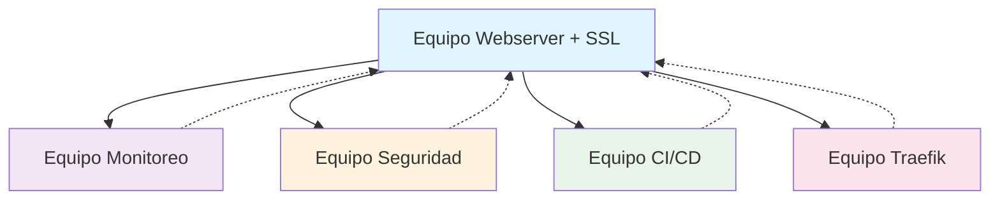

# 🚀 Infra Made Easy - Curso Introductorio

**Curso práctico de infraestructura** para aprender Ansible, AWS y DevOps a través de ejercicios colaborativos.

---

## 🎨 Estructura del Curso

Este curso está dividido en **2 etapas progresivas**:

### 🎯 **ETAPA 1** - Fundamentos (Individual)
**Objetivo**: Que todos los estudiantes desplieguen exitosamente un servidor web básico en AWS

- 💻 Deploy de instancia EC2 en AWS
- 🌐 Instalación de servidor web básico (Nginx)
- 🔑 Configuración de acceso SSH
- ✅ Verificación de funcionamiento

### 🤝 **ETAPA 2** - Equipos Colaborativos (Grupal)
**Objetivo**: Trabajar en equipos especializados que interactúan entre sí

#### 📈 **Equipo 1 - MONITOREO**
- Prometheus + Grafana
- Monitoreo de performance de todos los webservers
- Alertas y dashboards

#### 🌍 **Equipo 2 - WEBSERVER + SSL**  
- Configuración de dominios
- Certificados SSL/TLS
- Optimización de Nginx

#### 🔒 **Equipo 3 - SEGURIDAD (LYNIS)**
- Auditoría de seguridad con Lynis
- Hardening de servidores
- Reportes de seguridad

#### 🔄 **Equipo 4 - CI/CD**
- Deploy automático desde repositorio
- Pipelines de integración continua
- Automatización de despliegues

#### ⚙️ **Equipo 5 - TRAEFIK + ACME**
- Load balancer inteligente
- Certificados automáticos con ACME
- Routing dinámico

## 🚀 Inicio Rápido

### 🔥 ¡Empezar Ahora!

```bash
# 1. Clonar el repositorio
git clone https://github.com/SOLx-AR/infra-made-easy.git
cd infra-made-easy

# 2. Agregar tu usuario
mkdir users/tu-nombre
cp ~/.ssh/id_rsa.pub users/tu-nombre/

# 3. 🎯 ETAPA 1 - Deploy tu primer servidor
cd ansible
ansible-playbook playbooks/etapa1-webserver-basico.yml

# 4. 🤝 ETAPA 2 - Únete a un equipo (ejemplo: monitoreo)
ansible-playbook playbooks/etapa2/setup-monitoring.yml
```

---

## 🎯 ETAPA 1 - Webserver Básico

**¡Todos empiezan aquí!** Cada estudiante debe completar esta etapa antes de avanzar.

### 🎆 Qué vas a lograr:
- ✅ Una instancia EC2 funcionando en AWS
- ✅ Servidor web Nginx configurado
- ✅ Página web personalizada con tu nombre
- ✅ Acceso SSH configurado correctamente

### 📝 Pasos:
1. **Configurar AWS**: Tener credenciales y EC2 listo
2. **Ejecutar playbook**: `ansible-playbook playbooks/etapa1-webserver-basico.yml`
3. **Verificar**: Abrir tu IP en el navegador
4. **¡Celebrar!** 🎉 Ya tienes tu primer servidor automatizado

---

## 🤝 ETAPA 2 - Equipos Interactivos

**Una vez que completes la Etapa 1**, únete a uno de los 5 equipos. Cada equipo trabaja en una especialización diferente, pero **todos interactúan entre sí**.

### 📈 **Equipo MONITOREO** 
🎯 **Misión**: Vigilar la salud de todos los servidores del curso
```bash
ansible-playbook playbooks/etapa2/setup-monitoring.yml
```
**Entregables**:
- Dashboard de Grafana con métricas de todos los webservers
- Alertas cuando un servidor falle
- Reportes de performance

### 🌍 **Equipo WEBSERVER + SSL**
🎯 **Misión**: Evolucionar los webservers básicos a producción
```bash
ansible-playbook playbooks/etapa2/setup-webserver-ssl.yml
```
**Entregables**:
- Dominios personalizados para cada servidor
- Certificados SSL válidos
- Configuración optimizada de Nginx

### 🔒 **Equipo SEGURIDAD**
🎯 **Misión**: Auditar y fortalecer la seguridad de toda la infraestructura
```bash
ansible-playbook playbooks/etapa2/setup-security-lynis.yml
```
**Entregables**:
- Auditorías de seguridad con Lynis en todos los servidores
- Hardening automático
- Reportes de vulnerabilidades

### 🔄 **Equipo CI/CD**
🎯 **Misión**: Automatizar deployments de aplicaciones
```bash
ansible-playbook playbooks/etapa2/setup-cicd.yml
```
**Entregables**:
- Pipeline que deploya automáticamente al webserver
- Integración con repositorios Git
- Testing automatizado

### ⚙️ **Equipo TRAEFIK**
🎯 **Misión**: Crear load balancer inteligente para todos los servicios
```bash
ansible-playbook playbooks/etapa2/setup-traefik-acme.yml
```
**Entregables**:
- Load balancer para todos los servicios
- Certificados SSL automáticos
- Routing dinámico entre servicios

## 🛠️ Requisitos

### 💻 Software
- **Ansible** 2.10+
- **Python** 3.8+
- **AWS CLI** configurado
- **Git**

### ☁️ AWS
- Cuenta de AWS activa
- Credenciales configuradas
- Permisos para crear EC2

### 🧠 Conocimientos
- Línea de comandos básica
- Conceptos básicos de servidores
- ¡Ganas de aprender! 🚀

---

## 🎯 Primeros Pasos

### 1️⃣ Preparar tu Entorno
```bash
# Instalar Ansible
pip install ansible

# Verificar AWS CLI
aws sts get-caller-identity

# Clonar repositorio
git clone https://github.com/SOLx-AR/infra-made-easy.git
cd infra-made-easy
```

### 2️⃣ Agregar tu Usuario
```bash
# Crear tu directorio
mkdir users/tu-nombre

# Agregar tu clave SSH pública
cp ~/.ssh/id_rsa.pub users/tu-nombre/
```

### 3️⃣ Completar Etapa 1
```bash
# Configurar tu servidor básico
cd ansible
export MY_SERVER_IP="tu.ip.de.ec2"
ansible-playbook playbooks/etapa1-webserver-basico.yml
```

### 4️⃣ Elegir tu Equipo para Etapa 2
```bash
# Ejemplo: unirse al equipo de monitoreo
ansible-playbook playbooks/etapa2/setup-monitoring.yml
```

---

## 🎆 ¡Éxito!

Al completar este curso habrás aprendido:
- ✅ Automatización con Ansible
- ✅ Gestión de infraestructura en AWS
- ✅ Trabajo colaborativo en DevOps
- ✅ Especialización en un área (monitoreo, seguridad, CI/CD, etc.)
- ✅ Integración entre diferentes servicios

**¡Empezemos! 🚀**

## 🔗 Cómo Interactúan los Equipos



- **Monitoreo** vigila todos los servicios
- **Seguridad** audita toda la infraestructura
- **CI/CD** deploya aplicaciones al webserver
- **Traefik** balancea tráfico entre servicios
- **Webserver** es el centro donde todos convergen

---

## 📁 Estructura del Proyecto

```
infra-made-easy/
├── 👥 users/                    # 🎯 Directorio de estudiantes
│   ├── juan/
│   │   └── id_rsa.pub       # Clave SSH pública
│   ├── maria/
│   └── pedro/
├── 🗺️ teams/                    # 🤝 Configuración de equipos
│   ├── monitoring.yml       # Equipo 1
│   ├── webserver-ssl.yml    # Equipo 2  
│   ├── security-lynis.yml   # Equipo 3
│   ├── cicd.yml             # Equipo 4
│   └── traefik-acme.yml     # Equipo 5
├── 🤖 ansible/                  # Automatización
│   ├── inventory.yml        # Inventario de servidores
│   ├── ansible.cfg          # Configuración
│   └── playbooks/           # Playbooks por etapa
│       ├── 🎯 etapa1-webserver-basico.yml
│       └── 🤝 etapa2/
│           ├── setup-monitoring.yml
│           ├── setup-webserver-ssl.yml
│           ├── setup-security-lynis.yml
│           ├── setup-cicd.yml
│           └── setup-traefik-acme.yml
└── 📄 docs/                    # Documentación del curso
    ├── ETAPA1.md
    └── ETAPA2.md
```

---
